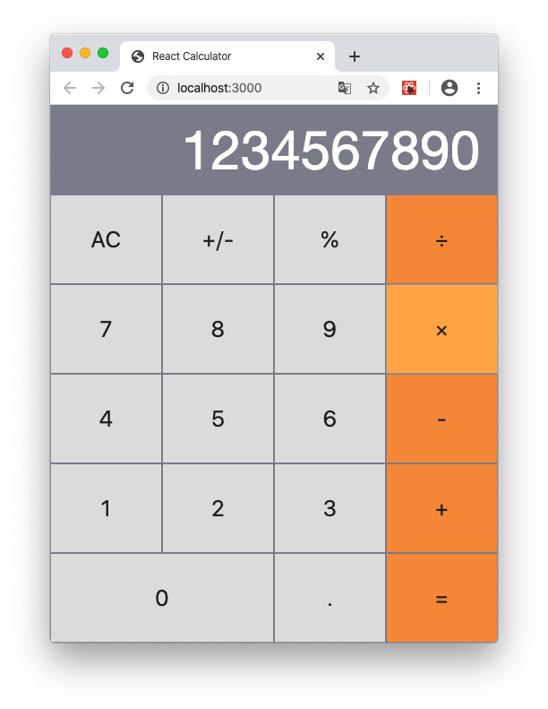

# React Calculator

A simple calculator app built using react

## Live Demo

[Live Demo Link](https://react-calculator-elshaka.herokuapp.com)

## Built With

- React
- Big.js
- Webpack
- PropTypes

## Getting Started

To get a local copy up and running follow these simple example steps.

### Setup
    git clone https://github.com/elshaka/react-calculator
    cd react-calculator
### Install
    npm install
### Run development server
    npm start
### Build
    npm run build
### Deployment
    heroku create $APP_NAME --buildpack mars/create-react-app
    git push heroku master

## Author

👤 **Eleazar Meza**

- Github: [@elshaka](https://github.com/elshaka)
- Linkedin: [Eleazar Meza](https://www.linkedin.com/in/elshaka/)
- Twitter: [@elshaka](https://twitter.com/elshaka)
